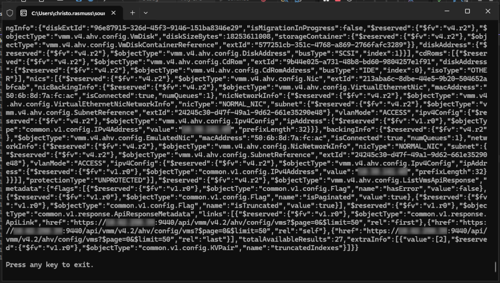

# Nutanix Code Samples - Microsoft C#

A collection of code samples demonstrating use of the Nutanix v4 SDKs.

## Requirements

- Microsoft Visual Studio
- Access to a Nutanix Prism Central instance, running Nutanix Prism Central 7.5 or later

## Nutanix v4 C# Code Sample Usage

Note: This example assumes use of the `list_vms` code sample.

- Clone this repository
- Open the **solution** in Microsoft Visual Studio e.g. `Nutanix v4 API Demo - List VMs.slnx`
- Open `Program.cs` and alter the following variables:

  - `requestUrl`
  - `username`
  - `password`

- Run the project using the appropriate button in Visual Studio
- Observe the output, ensuring you see either the full response (or exception details if something failed)

  