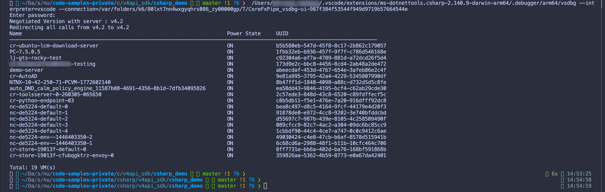
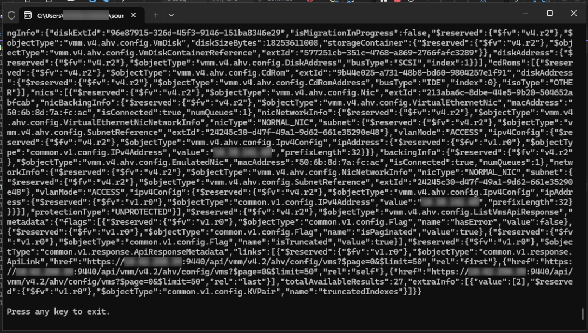

# Nutanix Code Samples - Microsoft C#

A collection of code samples demonstrating use of the Nutanix v4 SDKs.

## Requirements

- Access to a Nutanix Pris

## Recommended Software

These demos assume you have already installed Microsoft .NET and have access to the `dotnet` command.

- Microsoft VS Code
- DotNet 10.0

## Nutanix v4 C# Code Sample Usage

For all code samples:

- Clone this repository

### C# SDK

Note:

- This example assumes use of the `csharp_demo` SDK code sample.
- These notes cannot cover all environment configurations and contain suggestions only.

**Usage**:

- Open `environment.json`
- Edit the JSON values to match those in your environment
  - Prism Central FQDN/IP address
  - Prism Central username
  - For security reasons, your Prism Central password will be requested at runtime
- In the project directory, install the `vmm` SDK:

  ```
  dotnet add package Nutanix.VmmSDK --version 1.0.0
  ```

- Within VS Code, F5 to run the project
- Observe the output, ensuring you see a tabulated list of virtual machines found in your environment.

  

### REST APIs

Note: This example assumes use of the `list_vms` code sample.

- Open the **solution** in Microsoft Visual Studio e.g. `Nutanix v4 API Demo - List VMs.slnx`
- Open `Program.cs` and alter the following variables:

  - `requestUrl`
  - `username`
  - `password`

- Run the project using the appropriate button in Visual Studio
- Observe the output, ensuring you see either the full response (or exception details if something failed)

  