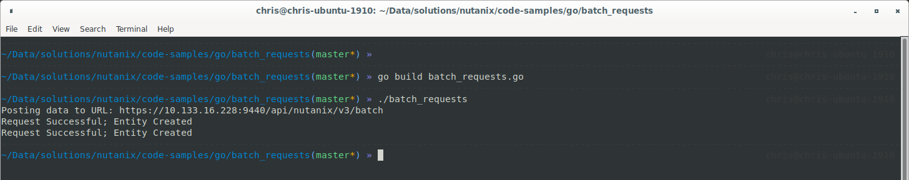

#####################
Batch Request with Go
#####################

Golang script to send batch tasks to Prism Central via v3 API.

************
Requirements
************

Please refer to `Nutanix Developer Portal Go samples <https://github.com/nutanixdev/code-samples/tree/master/go>`_ link for dependencies.

*******
Details
*******

This script sends batch v3 API calls to Prism Central to perform a set of tasks. The tasks are defined in the batch_request.json file.

*****
Usage
*****

To use this script, please following these steps:

- Edit **batch_requests.go** so that the environment values match your settings i.e. Prism Central IP etc
- Edit **batch_requests.json** to match your environment, in particular the cluster name and UUID

The script requires batch_requests.json as file as this file contains the payload for the batch call.

You can leave the file in the same directory as the go binary or point the code to the file location during run time. 

Usage Image:

****
Note
****

The json payload file contains a cluster reference that needs to be edited.  This must be the UUID of the cluster on which to create the VM and image as per the sample JSON payload file provided with this script.

Cluster UUID can be obtained by running “ncli cluster info” from Prism Element CVM or by using the Nutanix Prism APIs to request cluster details.
