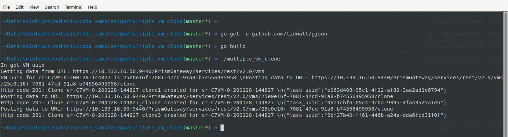

Go Code Samples - multiple_vm_clone.go
######################################

This readme file is specifically for the **multiple_vm_clone.go** Go code sample.

To run this code sample, please ensure the following requirements are met:

#. Go is already `installed on your system <https://golang.org/doc/install>`_

#. You have the **github.com/tidwall/gjson** package installed:

   .. code-block:: bash

      go get -u github.com/tidwall/gjson

Code Sample Details
...................

This Go code sample creates multiple clones of the specified VM in a specified network using the Nutanix Prism Element v2.0 API.

JSON Parameters
...............

The cloned VM parameters are specified via the JSON object within the **enterCloneName** function.  Please modify the parameters there if the example parameters are not suitable for your environment.

Usage
-----

#. Build the script:

   .. code-block:: bash

      go build

#. Run the compiled program:

   .. code-block:: bash

      ./multiple_clone_vm

Sample Screenshot
-----------------

The screenshot shows the script being built and run.

Note: The system used in the screenshot already has the github.com/tidwall/gjson package installed.

