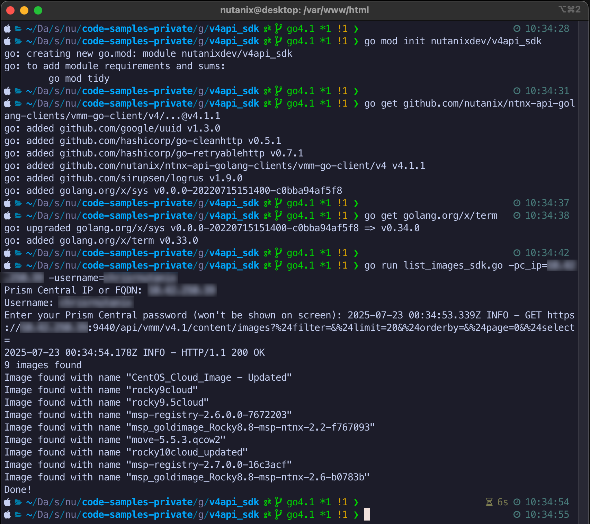

# Nutanix v4 SDK Sample Script

Code sample to demonstrate use of the Nutanix v4 APIs via Go SDK.

Requires Prism Central 7.3 or later and AOS 7.3 or later

## Usage

Example instructions are for a Linux or Mac OS X environment.

- Install Go in your local environment as per the [Go documentation](https://go.dev/doc/install)
- Create folder for your Go development (example only)

  ```
  mkdir ~/godev
  cd ~/godev
  ```

- Install dependencies, including the Nutanix Go SDKs:

  ```
  go mod init nutanixdev/v4api_sdk
  go get github.com/nutanix/ntnx-api-golang-clients/vmm-go-client/v4/...@v4.1.1
  go get golang.org/x/term
  ```

- Run script:

  ```
  go run list_images_sdk.go -pc_ip=<prism_central_ip_address_or_fqdn> -username=<prism_central_username> [-debug]
  ```

  Note: User will be prompted for password.  If `-debug` is specified, additional debug information will be shown during script execution.

## Screenshot



