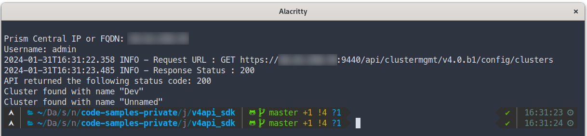

# Nutanix v4 SDK Sample Script: JS SDK

Code sample to demonstrate use of the new Nutanix v4 APIs via JS SDK.

This example demonstrates use of the Nutanix `clustermgmt` JS API library

## Usage

Example instructions are for a Linux or Mac OS X environment.

- Install Node.js as per the [official documentation](https://nodejs.org/en/download/)
- Add the [Nutanix clustermgmt JS Client](https://www.npmjs.com/package/@nutanix-api/clustermgmt-js-client) as a project dependency; for this demo we are using the `clustermgmt` SDK as it provides access to Cluster APIs:

  ```
  npm install @nutanix-api/clustermgmt-js-client
  ```

- Optional but useful: Install [ESLint](https://eslint.org/)

  ```
  npm init @eslint/config
  ```

  Answer the questions provided by the install process; the answers to these questions will vary from user to user.

- Rename `config-example.json` to `config.json`
- Edit `config.json` to include a valid Prism Central IP address and credentials for your environment
- Run the script:

  ```
  node list_clusters_sdk.js
  ```

## Screenshot


