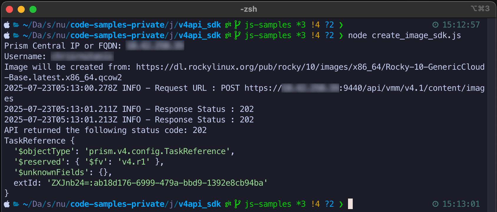

# Nutanix v4 SDK Sample Script: JS SDK

Code sample to demonstrate use of the Nutanix v4 APIs via JS SDK.

These examples demonstrate use of the Nutanix `vmm` and `clustermgmt` JS API libraries.

## Usage

Example instructions are for a Linux or Mac OS X environment.

- Install Node.js as per the [official documentation](https://nodejs.org/en/download/)
- Install dependencies; this demo uses the `vmm` and `clustermgmt` SDKs:

  ```
  npm install @nutanix-api/clustermgmt-js-client
  npm install @nutanix-api/vmm-js-client
  ```

- Optional but useful: Install [ESLint](https://eslint.org/)

  ```
  npm init @eslint/config
  ```

  Answer the questions provided by the install process; the answers to these questions will vary from user to user.

- Rename `config-example.json` to `config.json`
- Edit `config.json` to include a valid Prism Central IP address and credentials for your environment
- To use the image creation demo, ensure the correct cluster extId is provided for `cluster_extid`
- Run the script(s):

  ```
  node list_clusters_sdk.js
  ```

  - or -

  ```
  node create_image_sdk.js
  ```

## Screenshots



