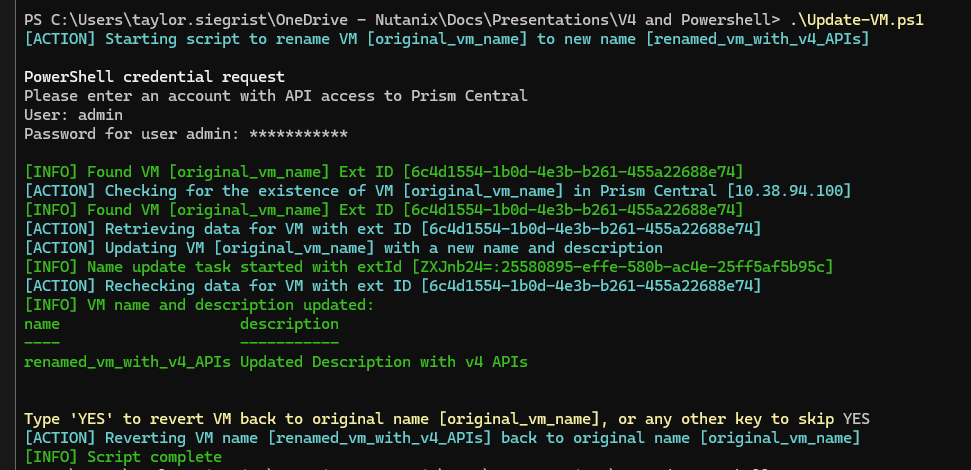

# PowerShell Code Sample for Nutanix v4 APIs: Update Virtual Machine Configuration

This code sample demonstrates use of the Nutanix v4 APIs to perform a simple virtual machine rename operation.

# Namespaces Used

- `vmm` (Virtual Machine Management)
- `prism` (Prism, optional, can be used for task monitoring if required)

# Requirements

- Microsoft PowerShell 7+
- Connection to a Nutanix Prism Central instance running pc7.3 or later

# Usage

- Clone this repository
- Edit the `powershell/v4api_client/update_vm.ps1` script, if required (optional, environment-dependent)
- Run the script:

  ```
  ./update_vm.ps1
  ```

# Screenshot


