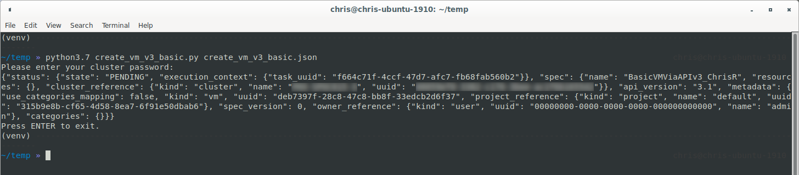

# Nutanix Developer Portal Code Samples - Python

To use the Python code samples, the following environment is recommended.

- Python >=3.7 (3.7 or later)
- The accompanying JSON files from this repository (instructions and usage provided below).
- A suitable Python editor, e.g. `Microsoft Visual Studio Code <https://code.visualstudio.com/>`_ for GUI editing.
- Access to a Nutanix Cluster for testing Prism Element code samples (API v2.0)
- Access to a Nutanix Prism Central instance for testing Prism Central code samples (API v4 and v4)

## Python Script Usage

The provided Python scripts are designed to be standalone and can be run without additional dependencies beyond those provided above.

The examples and screenshots below are from the **create_vm_v3_basic** sample.  This sample uses **create_vm_v3_basic.json** for the request parameters.

Note: These steps also assume you are copying/pasting code directly from the repository in the event that you haven't cloned the entire repository to your local machine.

- Clone this repository
- Create and activate a Python virtual environment:

  ```
  python -m venv venv
  . venv/bin/activate
  ```

- If `requirements.txt` present, install dependencies:

  ```
  pip install -r requirements.txt
  ```

- Edit `create_vm_v3_basic.json` and set appropriate values for your environment.
- Run the script:

  ```
  python create_vm_v3_basic.py create_vm_v3_basic.json
  ```

- The script will prompt for your account password, then submit the request based on the script spec.  An example based on **create_vm_v3_basic.py** is shown below, running on Ubuntu 19.04.

  

- Check the output to make sure the request has a state of **PENDING**.
