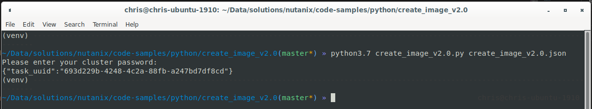

########################################
Create Image with v2.0 Prism Element API
########################################

Python script to connect to Prism Element and use the v2.0 APIs to create a disk image.

**********
Disclaimer
**********

This is **not** a production-grade script.  Please make sure you add appropriate exception handling and error-checking before running it in production.  See note re versions below, too.

******
Author
******

Chris Rasmussen, Developer Content Architect, Nutanix (Melbourne, AU)

*********
Changelog
*********

- 2020.02.26 - Code sample reorganised into individual folder
- 2019.07.23 - Code sample created

*******
Details
*******

Connect to Prism Element and use the v2.0 APIs to create a disk image.

Requires create_image_v2.0.json to be populated with the following information:

- **cluster_ip**: Prism Element IP address
- **username**: The username for your Prism Element instance
- **ctr_name**: The name of the container that will store the new image
- **ctr_uuid**: The UUID of the container that will store the new image
- **iso_url**: The full URL for the ISO file to use when creating the image
- **image_name**: The name for the new image (this will appear in image lists)
- **image_annotation**: A meaningful description for the new image

Example v2.0 API **GET** request to get container information:

.. code-block:: bash

   https://cluster_ip:9440/api/nutanix/v2.0/storage_containers

*****
Usage
*****

Virtual Environment
===================

All the steps below assume you have a terminal session running with the current directory set to the location of the script.

- It is strongly recommended to run development scripts like this within a virtual environment.  For example, if using Python 3.7 on Linux:

  .. code-block:: bash

     python3.7 -m venv venv
     . venv/bin/activate

- Install dependencies:

  .. code-block:: bash

     pip3 install -e .

- Edit **create_image_v2.0.json** to match your environment

Script Command Line
===================

.. code-block:: bash

   python3.7 create_image_v2.0.py --help

Generates:

.. code-block:: bash

   usage: create_image_v2.0.py [-h] json

   positional arguments:
     json        JSON file containing query parameters

   optional arguments:
     -h, --help  show this help message and exit

*****
Notes
*****

- High-level testing has been carried out on Prism Element version 5.12
- Other versions may produce unpredictable results
- The installation of specific Python versions, pip3 etc are beyond the scope of this readme

*******
Example
*******

A complete command-line example is shown below:

.. code-block:: bash

   python3.7 create_image_v2.0.py create_image_v2.0.json

**********
Screenshot
**********

This is what the script looks like as it is run.  This screenshot is the output of the example command above.

*******
Support
*******

These scripts are *unofficial* and are not supported or maintained by Nutanix in any way.

In addition, please also be advised that these scripts may run and operate in ways that do not follow best practices.  Please check through each script to ensure it meets your requirements.

**Changes will be required before these scripts can be used in production environments.**