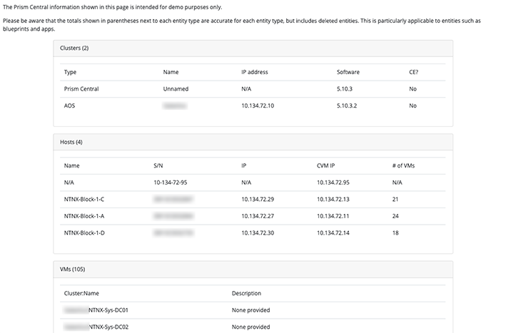

####################
Nutanix Cluster Info
####################

"As-built" documentation script for use with Nutanix **Prism Central** 5.5.0.6 or later.

**This sample script is no longer supported for use with Prism Element - Prism Central only, sorry.**

High-level testing has been carried out on AOS versions from 5.5.0.6 to 5.10.5.  Later versions may cause unpredictable results.

**********
Disclaimer
**********

This is **not** a production-grade script.  Please make sure you add appropriate exception handling and error-checking before running it in production.  See note re versions below, too.

******
Author
******

Chris Rasmussen, Developer Content Architect, Nutanix (Melbourne, AU)

*********
Changelog
*********

- 2024.06.26 - Removed network security rule APIs (no longer supported), added template example
- 2019.07.22 - Removed all references to PDF generation and replaced with HTML generation
- 2019.07.18 - Rewrote large parts for better Python readability
- 2018.08.30 - Committed setup.py and Pipenv usage suggestions.  Added some exception handling re PC host vs PE host.
- 2018.07.21 - Added better parameter input and options.
- 2018.04.22 - Updated with installation and usage instructions for Windows 10 64-bit.
- 2018.04.04 - Published version based on Prism Central and v3 API.
- 2017.09.06 - Published new version based on Python 3.

*******
Details
*******

Connect to a Nutanix Prism Central instance, grab some high-level details then generate an HTML report from it.

The intention is to use this script to generate very high-level and *unofficial* as-built documentation.

The other idea is for you, the user, to take this script and modify it to suit your requirements.

*****
Usage
*****

Virtual Environment
===================

All the steps below assume you have a terminal session running with the current directory set to the location of the script.

- It is strongly recommended to run development scripts like this within a virtual environment.  For example, if using Python 3.7 on Linux:

  .. code-block:: bash

     python3.7 -m venv venv
     . venv/bin/activate

- Install dependencies:

  .. code-block:: bash

     pip3 install -e .

- Edit basic parameters

   - **self.entity_response_length** - Dictates how many entities are returned from a single request. **Maximum** value can be **500**.
   - **self.read_timeout** - Increase or decrease depending on the desired timeout delay (in seconds) for each request

Templates
=========

An example template has been included with this repository.

- Rename `templates/nutanixv3.html.example` to `templates/nutnixv3.html`, if required.

Script Command Line
===================

.. code-block:: bash

   ./get_cluster_info.py --help:

Generates:

.. code-block:: bash

   usage: get_cluster_info_v3.py [-h] [-u USERNAME] [-p PASSWORD] pc_ip

   positional arguments:
     pc_ip                 Prism Central IP address

   optional arguments:
     -h, --help            show this help message and exit
     -u USERNAME, --username USERNAME
                           Prism Central username
     -p PASSWORD, --password PASSWORD
                           Prism Central password
     -d [enable/disable], --debug [enable/disable]
                           Enable/disable debug mode e.g. show debug info at various stages through the script

*****
Notes
*****

- This script **did** support Community Edition, but now supports "full" Prism Central only
- High-level testing has been carried out on AOS versions from 5.5.0.6 to 5.10.5.
- Later versions may cause unpredictable results.
- The installation of specific Python versions, pip3 etc are beyond the scope of this readme

****************
Custom Templates
****************

Summary
=======

The repo includes 'templates/nutanixv3.html', an HTML5 document containing a sample layout that can be used with this script.  If you want to modify the generated HTML report's content or layout, edit templates/nutanixv3.html to suit your requirements.

Available Fields
================

Please make sure the file is saved as 'templates/nutanixv3.html' when you are finished.

As of the current release, the required fields in templates/nutanixv3.html are as follows (all are to be prefixed with a '$' symbol, as shown):

- $clusters                   [ The list of clusters visible from your PC instance ]
- $hosts                      [ The hosts visible from your PC instance ]
- $vms                        [ The VMs managed by your PC instance ]
- $subnets                    [ The subnets managed by your PC instance ]
- $projects                   [ List of projects managed by your PC instance ]
- $apps                       [ List of Calm apps managed/deployed by your PC instance ]
- $blueprints                 [ List of available calm blueprints in your PC instnace ]
- $network_security_rules     [ List of Flow network security rules managed by your PC instance ]
- $images                     [ List of images available via your PC instance ]
- $day                        [ The date this script was run ]
- $now                        [ The time this script was run ]
- $username                   [ The username of the current logged-in user ]
- $computer_name               [ The current local computer name ]

HTML Formatting
===============

As of version 3.0, this script uses Bootstrap and Google Fonts for HTML formatting.

**********
Screenshot
**********

This is what the HTML report looks like, once generated (partial screenshot shown):

*****
To-do
*****

- Change $variable substitution to use Jinja2

*******
Support
*******

These scripts are *unofficial* and are not supported or maintained by Nutanix in any way.

In addition, please also be advised that these scripts may run and operate in ways that do not follow best practices.  Please check through each script to ensure it meets your requirements.

**Changes will be required before these scripts can be used in production environments.**
