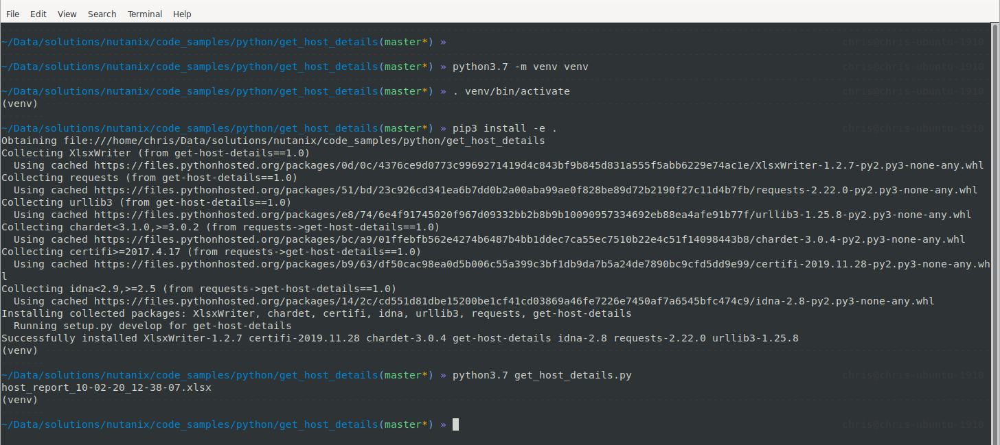
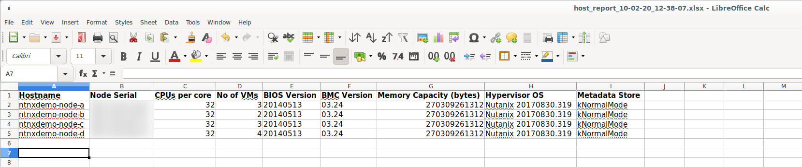

Python Code Samples - get_host_details.py
#########################################

This readme file is specifically for the **get_host_details.py** Python code sample.

The setup instructions are the same as all other python code samples in this repository.  This file is provided as additional/supplemental information for this specific code sample.

Please see the `main <https://github.com/nutanixdev/code-samples/tree/master/python>`_ page for general instructions.

Usage & Example
---------------

It is strongly recommended that Python development and demo scripts are run using a `Python virtual environment <https://docs.python.org/3/library/venv.html>`_.

Example:

#. Edit the script and replace all environment-specific variables so they match your environment.

#. Create and activate the virtual environment:

   .. code-block:: bash

      python3.7 -m venv venv
      . venv/bin/activate

#. Install dependencies:

   .. code-block:: bash

      pip3 install -e .

#. Run the script:

   .. code-block:: bash

      python3.7 ./get_host_details.py

Demo screenshot:

In the example above, **host_report_10-02-20_12-38-07.xlsx** has been generated and looks like the screenshot below:

