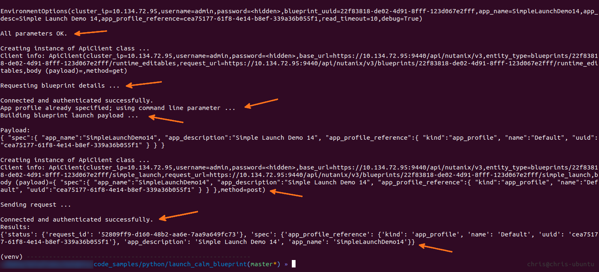
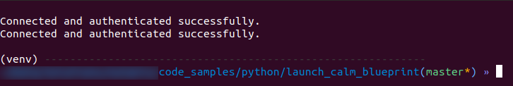

#####################
Launch Calm Blueprint
#####################

Python script to launch a Nutanix Calm blueprint via the v3 REST API.

High-level testing has been carried out on AOS version 5.10.5.  Other versions may cause unpredictable results.

**********
Disclaimer
**********

This is **not** a production-grade script.  Please make sure you add appropriate exception handling and error-checking before running it in production.  See note re versions below, too.

******
Author
******

Chris Rasmussen, Developer Content Architect, Nutanix (Melbourne, AU)

*********
Changelog
*********

- 2019.07.23 - Code sample created

*******
Details
*******

Connect to a Nutanix Prism Central instance, provide a Nutanix Calm blueprint UUID then launch the blueprint.

The intention is to use this approach for the launch of Nutanix Calm blueprints as part of external script workflows.

Requires only the blueprint UUID; all other requirements are extracted from the blueprint by making other API requests.

Modules
=======

Two major parts of the script have been broken out into separate modules:

- EnvironmentOptions
- ApiClient

As each name suggests, command-line/environment options are handled by **EnvironmentOptions** and the API requests are handled by **ApiClient**.

This isn't mandatory but can form the basis for good practice later.

*****
Usage
*****

Virtual Environment
===================

All the steps below assume you have a terminal session running with the current directory set to the location of the script.

- It is strongly recommended to run development scripts like this within a virtual environment.  For example, if using Python 3.7 on Linux:

  .. code-block:: bash

     python3.7 -m venv venv
     . venv/bin/activate

- Install dependencies:

  .. code-block:: bash

     pip3 install -e .

- Edit basic parameters

   - **self.read_timeout** - Increase or decrease depending on the desired timeout delay (in seconds) for each request

Script Command Line
===================

.. code-block:: bash

   ./launch_calm_blueprint_v3.py --help

Generates:

.. code-block:: bash

   usage: launch_calm_blueprint_v3.py [-h] [-a APP_PROFILE] [-u USERNAME]
                                   [-p PASSWORD] [-d DEBUG]
                                   pc_ip blueprint_uuid app_name app_desc

   positional arguments:
     pc_ip                 Prism Central IP address
     blueprint_uuid        UUID of the blueprint to be launched
     app_name              The name of the application to be launched
     app_desc              Description for the new application

   optional arguments:
     -h, --help            show this help message and exit
     -a APP_PROFILE, --app_profile APP_PROFILE
                           App profile reference UUID
     -u USERNAME, --username USERNAME
                           Prism Central username
     -p PASSWORD, --password PASSWORD
                           Prism Central password
     -d DEBUG, --debug DEBUG
                           Enable/disable debug mode

APP_PROFILE parameter
=====================

If the **APP_PROFILE** parameter is not specified using **-a** or **--app_profile**, the script will look for an application profile named **Default**.  If no application is found with the name **Default**, the API will throw an HTTP 422 error that indicates the provided app_profile_reference does not match the required format.  The script could easily be modified to check for this case, but has been written this way so users can see what happens in this instance.  For example:

.. code-block:: bash

   An HTTP client error has occurred (422)
   Details: {'spec.app_profile_reference.uuid': ["u'' does not match '^[a-fA-F0-9]{8}-[a-fA-F0-9]{4}-[a-fA-F0-9]{4}-[a-fA-F0-9]{4}-[a-fA-F0-9]{12}$'"]}
   Message: Request could not be processed.
   Reason: INVALID_REQUEST

*****
Notes
*****

- High-level testing has been carried out on AOS version 5.10.5.
- Other versions may produce unpredictable results.
- The installation of specific Python versions, pip3 etc are beyond the scope of this readme

*******
Example
*******

A complete command-line example including all required parameters and optional **--app_profile** is shown below:

.. code-block:: bash

   ./launch_calm_blueprint_v3.py 10.134.72.95 22f83818-de02-4d91-8fff-123d067e2fff SimpleLaunchDemo14 "Simple Launch Demo 14" --debug enable -u <username> -p <password> -a cea75177-61f8-4e14-b8ef-339a36b055f1;

**********
Screenshot
**********

This is what the script looks like as it is run (debug mode enabled).  This screenshot is the output of the example command above.

The same command with debug **disabled** shows output as per the screenshot below:

*******
Support
*******

These scripts are *unofficial* and are not supported or maintained by Nutanix in any way.

In addition, please also be advised that these scripts may run and operate in ways that do not follow best practices.  Please check through each script to ensure it meets your requirements.

**Changes will be required before these scripts can be used in production environments.**