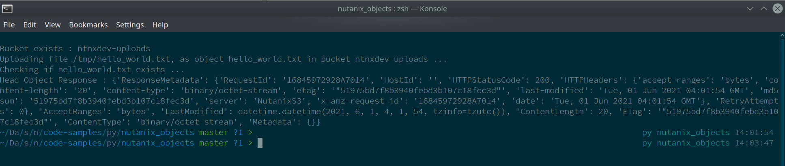

# Nutanix Objects Operations

Language: Python 3

## Description

Various code samples to work with Nutanix Objects via API.

- Upload a file to a Nutanix Objects bucket via the Object APIs
- Create multiple Nutanix Objects buckets and attach lifecycle policy

## Suggested Usage for File Upload Demo

Other scripts will follow almost identical steps.

- Clone this repo
- Edit `upload_file.py` and set appropriate variables to match your environment:

  - `endpoint_url`: An accessible "Objects Public IP"
  - `access_key`: The access key for your Objects credentials
  - `secret_key`: The secret key for your Objects credentials
  - `bucket`: The bucket to which the script will upload files
  - `filename`: The full path to the file that will be uploaded
  - `key`: Object key for which the PUT action was initiated

- Create and activate a Python virtual environment:

  ```
  python3.9 -m venv venv
  . venv/bin/activate
  ```

- Install dependencies:

  ```
  pip3 install -r requirements.txt
  ```

  Note: The `black` requirement is not mandatory for script usage.  It has been included as an extra module to aid in correct code formatting.

- Verify the filename specified by the `filename` variable exists and is accessible
- Run the demo script, assuming your terminal's current directory is the directory containing `objects_upload.py`:

  ```
  python ./upload_file.py
  ```

### Example Output



## License

Please see the `LICENSE` file distributed with this repository.

## Disclaimer

Please see the `.disclaimer` file distributed with this repository.
