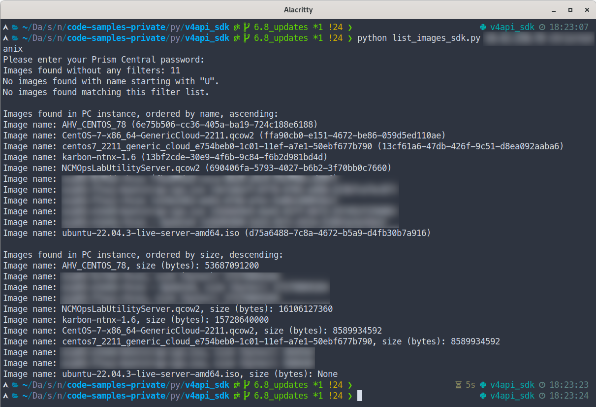
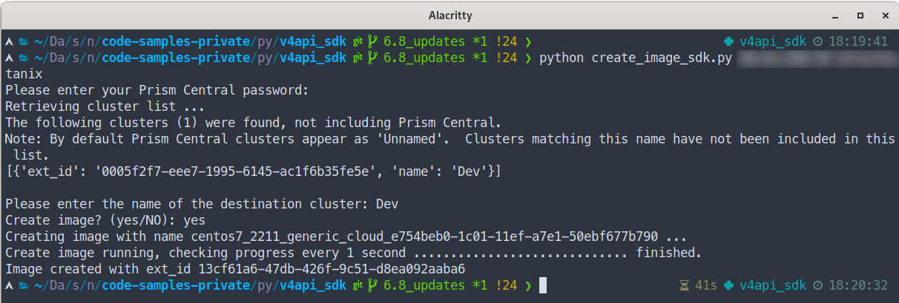
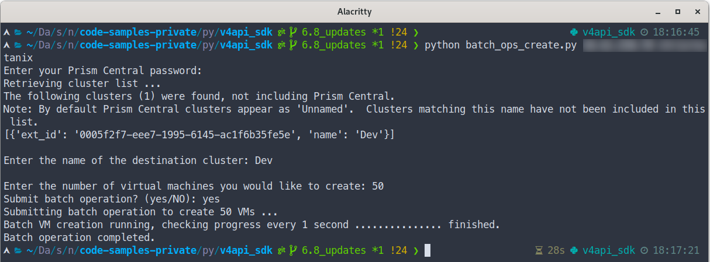
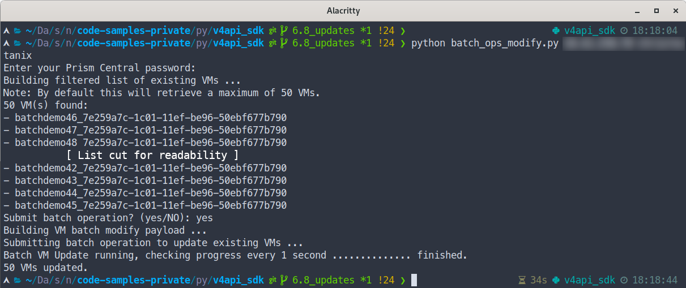
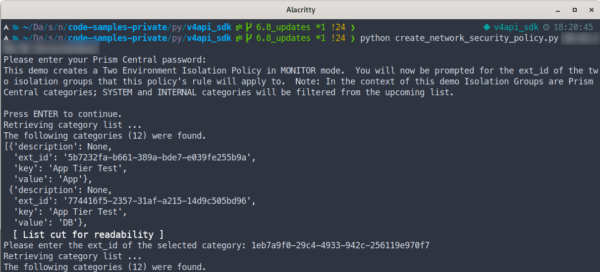
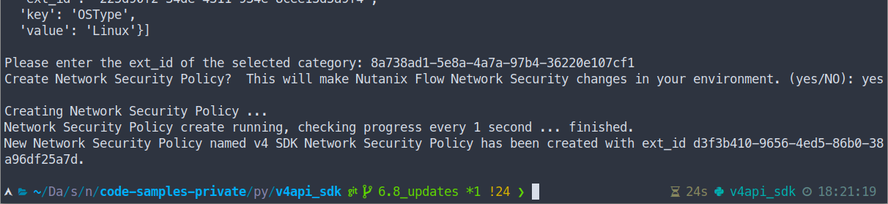
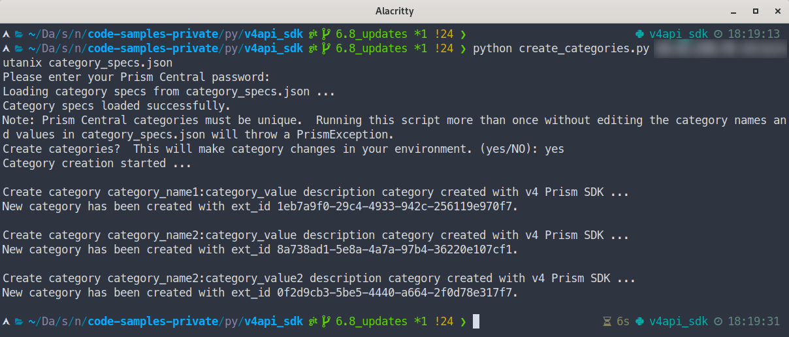
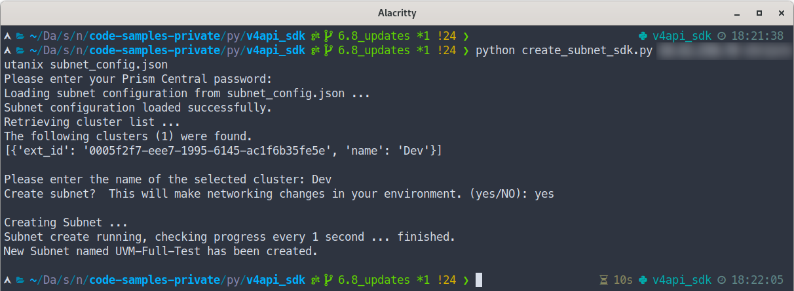
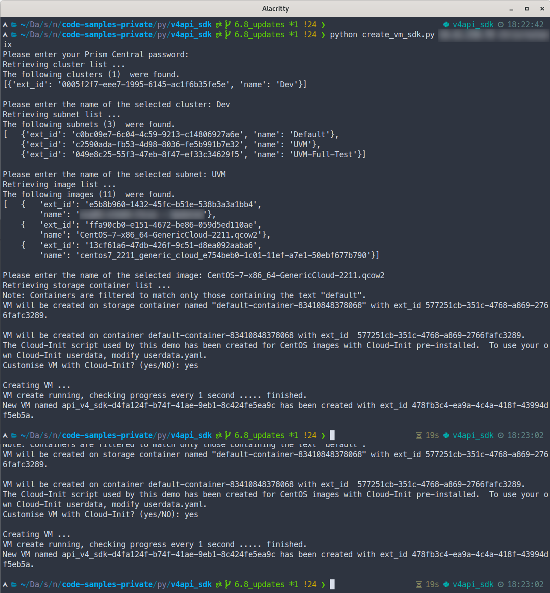

# Nutanix v4 SDK Sample Scripts

Code samples to demonstrate use of the new Nutanix v4 APIs via Python SDK.

## Requirements

- Python 3.6, 3.7, 3.8 and 3.9 are officially supported
- Nutanix Prism Central 2024.1 or later
- Nutanix AOS 6.8 or later

## Usage

- Create and activate a Python virtual environment:

  ```
  python -m venv venv
  . venv/bin/activate
  ```

- Install required packages:

  ```
  pip install -r requirements.txt
  ```

- Run script e.g. list Prism Central images:

  ```
  python list_images_sdk.py <prism_central_ip> <username>
  ```

  Note: User will be prompted for password

## Testing

This repository provides two additional files. Using them is optional.

- `startup.example.json`: Should be renamed to `startup.json` and edited to contain details appropriate for your environment.
- `startup.py`: A script that can be used to initialise the Python REPL during testing.  This script will import various Nutanix Python SDKS, instantiate the SDKs and create objects useful during testing.  Note: This script is for testing only and contains very limited error checking and validation.

To use these optional files, continue below:

- Create and activate Python virtual environment as per the steps above
- Rename `startup.json.example` to `startup.json`
- Edit `startup.json` to contain values appropriate for your environment
- Initialise the Python REPL using `startup.py`:

  ```
  python -i startup.py
  ```
- If the script returns no errors, initialisation was successful.

## Screenshots

### List Images



### Create Image



### Batch Operations




### Create Network Security Policy




### Create Categories



### Create Networking Subnet



### Create Virtual Machine


