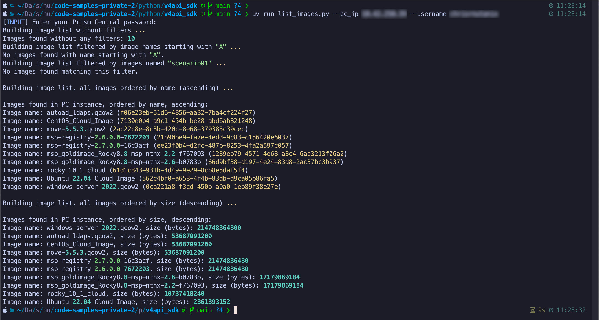

# Nutanix Code Samples - v4 Python SDK

A collection of code samples demonstrating use of the Nutanix v4 SDKs.

Note: These code samples are specific to the Nutanix v4 Python SDK.  For Python code samples using non-SDK methods, e.g. Python requests, see the **python/v4api_client** directory within this repository.

## Requirements

- Python >=3.9 (3.9 or later)
- The accompanying JSON files from this repository (instructions and usage provided below).
- A suitable Python editor, e.g. **Microsoft Visual Studio Code <https://code.visualstudio.com/>**_ for GUI editing.
- Access to a Nutanix Prism Central instance, running Nutanix Prism Central 7.5 or later

## Python Environment

In February 2026, the majority of Nutanix v4 Python SDK code samples moved from `pip` to [`uv`](https://docs.astral.sh/uv/); ensure you have installed `uv` before using the Nutanix v4 Python SDK code samples.

From a user perspective, script dependencies are now managed through `pyproject.toml` instead of `requirements.txt.`. See the following usage notes for complete `uv` usage with this repository.

Code samples in subdirectories may contain a local README.md with instructions specific to that code sample.

## Nutanix v4 Python SDK Code Sample Usage

- Clone this repository; this is critical as it ensures the accompanying `tme` module is available.
- Install dependencies using `uv`:

  ```
  uv sync
  ```

- Run the script; the example below uses the `list_images.py` script:

  ```
  uv run list_images.py --pc_ip <prism_central_ip> --username <prism_central_username>
  ```

- The script will prompt for your account password, then submit the request based on the script spec.

  

  