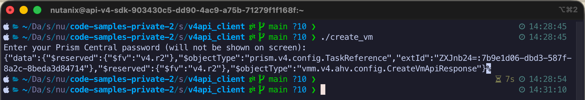

# Nutanix v4 API Code Samples - Shell/Bash

A simple code sample to demonstrate the creation of an AHV VM using the Nutanix v4 APIs.

## Requirements

- [`jq`](https://jqlang.org/)
- [`uuidgen`](https://man7.org/linux/man-pages/man1/uuidgen.1.html)

## Usage

- Rename `create_vm_example.json` to `create_vm.json`
- Edit `create_vm.json` to contain settings appropriate for your environment
- Make sure the script is executable:

  ```
  chmod u+x create_vm
  ```

- Run the script

  ```
  ./create_vm
  ```

## Screenshot

